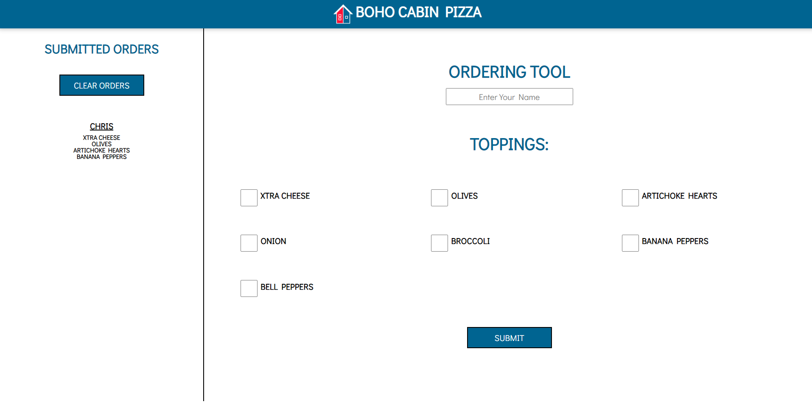

# Boho Cabin Pizza Portal

I love Pizza. It is hands Down my favorite food. That is a big problem for me for a few reasons; My family lives ina rural area with no delivery, and we are vegan. Because of this I have had to learn to make it myself. I decided to make a fun app so that we can sort of have the experieince of ordering online.

**Link to project:** https://BohoCabinPizza.netlify.app/

## How It's Made:

**Tech used:** HTML, CSS, JavaScript

This was pretty simple really. I started with the HTML and CSS to make it look pretty, and then I made the javascript! Users can enter their name and order, and then I can clear them once they are made.

## Optimizations

This started with each "submission" generating a new DOM element that used the name and checked boxes. This was messy and I wanted to clear it up a bit. So I switched to using local storage to store, and then refresh the DOM on each submission. This worked out perfectly and I dont have to worry about losing our orders. 

## Lessons Learned:

I have been so focused on Javascript lately that this project was a great refresher on CSS. It also was a good lesson on using locaStorage to make my life easier. 

## Planned Updates
I will be updating this later with MediaQueries and a more flexible layout. I just wanted to get this live so that we could use it for our dinner this evening!

